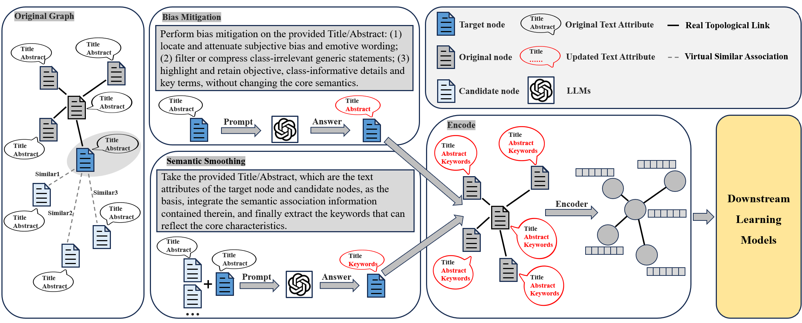

# Toward More Expressive Graphs: LLM-Driven Bias Mitigation and Semantic Smoothing for Text-Attributed Graphs


## 1. Environment Setup with Conda💻
#### Using Conda
```bash
# Create and activate environment
conda create -n BSLGL python=3.8 -y
conda activate BSLGL

# Install PyTorch (select CPU or GPU version)
# CPU version:
conda install pytorch torchvision torchaudio cpuonly -c pytorch -y

# GPU version (CUDA 11.7):
conda install pytorch torchvision torchaudio cudatoolkit=11.7 -c pytorch -y

# Install dependencies
conda install numpy pandas scikit-learn -y
conda install -c conda-forge sentence-transformers chardet requests -y
conda install -c anaconda gensim nltk pytz -y
conda install -c pyg pyg -y

# Download NLTK data
python -c "import nltk; nltk.download('punkt')"
```

## 2. Download Required Files📥
The following related files need to be downloaded:

| Resource Type               | Description                          | Download Link |
|-----------------------------|--------------------------------------|---------------|
| **Original TAGs datasets**  | Base datasets for all experiments    | [Download](https://drive.google.com/drive/folders/158wnv1zp2xOX2fKCUeLrzpxrpKRkJJzO?usp=drive_link) |
| **BSLGL processed texts**   | Enhanced text data                  | [Download](https://drive.google.com/drive/folders/1e8WMWOM46jhUhMQqwn0cJPCZSIv0J-lN?usp=drive_link) |
| **All embeddings**           | Pre-computed embeddings             | [Download](https://drive.google.com/drive/folders/1yEc8ughAx5xzqLnwSqCZ2v9RLYfpPDAh?usp=drive_link) |
| **LLM-as-Predictors results** | Direct prediction results from LLMs | [Download](https://drive.google.com/drive/folders/10_am9RXS2BbV6aHuSOmfQur5GLLUDGyV?usp=drive_link) |

## 3. Project Structure📂
```
BSLGL/
├── code/                   # Core implementation
│   ├── config.py           # Configuration options
│   ├── trainGNN.py         # Main training script
│   └── ...                 # More
├── dataset/                # Original datasets
├── embeddings/             # Pre-computed embeddings
├── enhanced_texts/         # Processed text data
└── llm_predict_result/     # LLM prediction outputs
```

## 4.Train🏋️ 

**Run Example：**
```
python -m code.trainGNN  --dataset cora --gnn_model_name SAGE --gnn_train_feature_type enhanced
```
```
# Example configuration options⚙️
DATASET_OPTIONS = ['cora', 'pubmed', 'arxiv', ...]
MODEL_OPTIONS = ['SAGE', 'MLP', 'GCN']
FEATURE_TYPES = ['original', 'enhanced', ...]
```
Specific parameter modifications can be made by selecting the corresponding options in the **BSLGL/code/config.py** file according to your needs.
