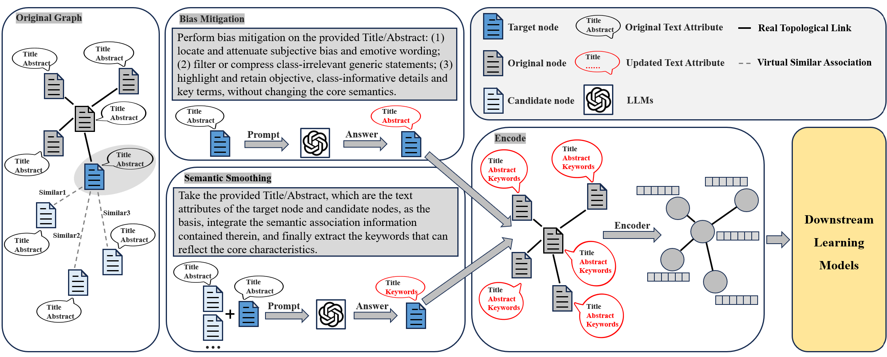

# Graph Learning on Text-Attributed Graphs: Bias Mitigation and Semantic Smoothing via LLMs


## 1.Environment Setup with Conda
```

conda create -n BSLGL python=3.8 -y

conda activate BSLGL

#CPU

conda install pytorch torchvision torchaudio cpuonly -c pytorch -y

#GPU

conda install pytorch torchvision torchaudio cudatoolkit=11.7 -c pytorch -y

conda install numpy pandas scikit-learn -y

conda install -c conda-forge sentence-transformers chardet requests -y

conda install -c anaconda gensim nltk pytz -y

conda install -c pyg pyg -y

python -c "import nltk; nltk.download('punkt')"
```

## 2.Download
The following related files need to be downloaded.

**Orig TAGs datasets:**  
[dataset](https://drive.google.com/drive/folders/158wnv1zp2xOX2fKCUeLrzpxrpKRkJJzO?usp=drive_link)

**BSLGL_processed texts:**  
[enhanced_texts](https://drive.google.com/drive/folders/1e8WMWOM46jhUhMQqwn0cJPCZSIv0J-lN?usp=drive_link)

**All of Embeddings:**
[embeddings](https://drive.google.com/drive/folders/1yEc8ughAx5xzqLnwSqCZ2v9RLYfpPDAh?usp=drive_link)

**Results of LLM-as-Predictors:**
[llm_predict_result](https://drive.google.com/drive/folders/10_am9RXS2BbV6aHuSOmfQur5GLLUDGyV?usp=drive_link)

## 3.Train
**You should ensure that the following folders—code, dataset, embeddings, enhanced_texts, and llm_predict_result—are present in your root directory (BSLGL).**

**code:** Core code Logicc.

**dataset:** Orig TAGs datasets.

**embeddings:** All encoded embeddings used in This project .

**llm_predict_result:** Results of direct text prediction by LLMs.

**Run Example：**
```
python -m code.trainGNN  --dataset cora --gnn_model_name SAGE --gnn_train_feature_type enhanced
```
Specific parameter modifications can be made by selecting the corresponding options in the **BSLGL/code/config.py** file according to your needs.
